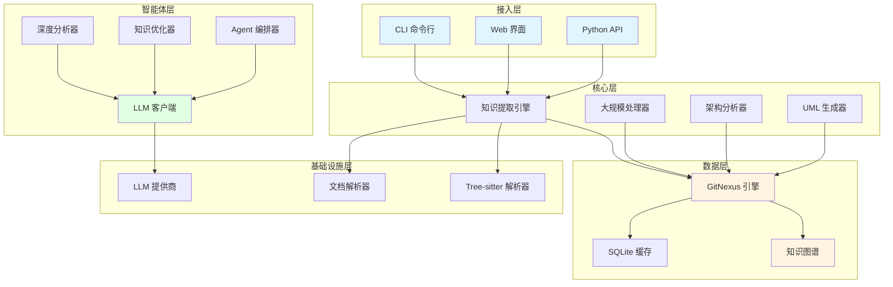
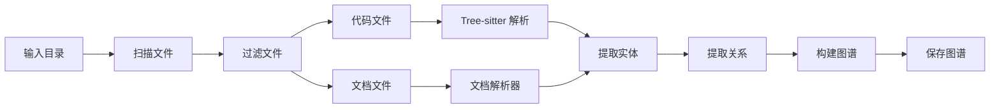
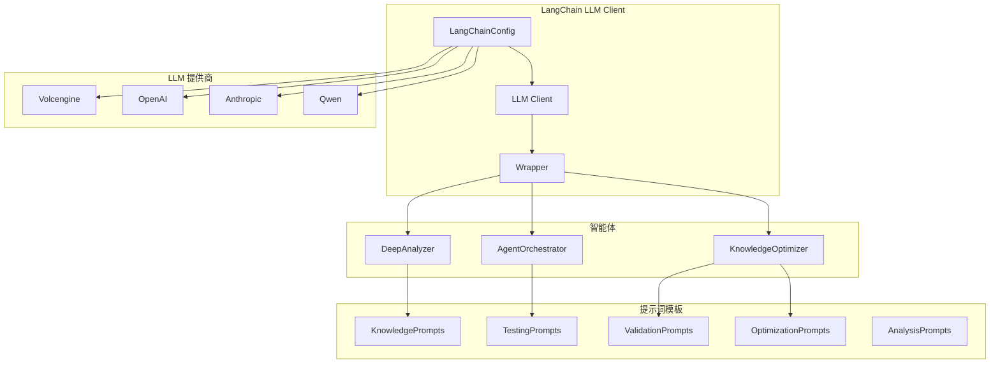
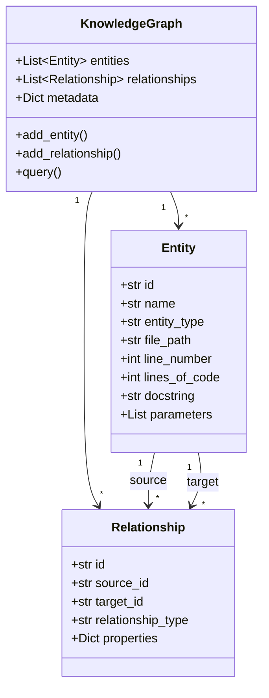
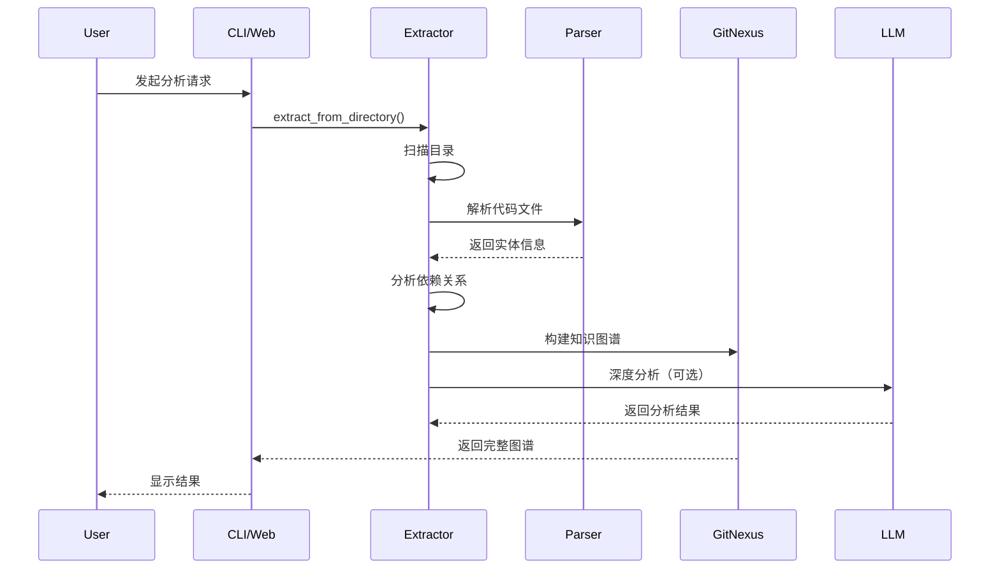
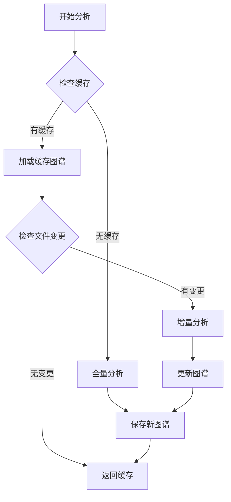

# 系统架构设计文档

## 目录
- [1. 系统概述](#1-系统概述)
- [2. 整体架构](#2-整体架构)
- [3. 核心模块设计](#3-核心模块设计)
- [4. 数据模型](#4-数据模型)
- [5. 数据流向](#5-数据流向)
- [6. 技术选型](#6-技术选型)
- [7. 性能优化](#7-性能优化)
- [8. 扩展性设计](#8-扩展性设计)

---

## 1. 系统概述

### 1.1 项目定位

**知识提取智能体 (KN-Fetch)** 是一个智能化的代码和文档分析工具，能够自动化提取项目知识、生成结构化知识图谱，并利用 LLM 进行深度分析。

### 1.2 核心功能

- ✅ **代码分析**: 支持多种编程语言的代码解析
- ✅ **文档处理**: 提取 Markdown、PDF、Word 等文档内容
- ✅ **知识图谱**: 构建实体-关系知识图谱
- ✅ **LLM 增强**: 使用大模型进行深度分析和优化
- ✅ **自测试**: 自动生成和运行测试用例
- ✅ **自验证**: 验证知识提取的准确性
- ✅ **Web 界面**: 提供友好的 Web 管理界面
- ✅ **大规模处理**: 支持百万行级别项目分析

### 1.3 设计理念

1. **模块化**: 各功能模块职责清晰，低耦合高内聚
2. **可扩展**: 支持插件式扩展新的语言和功能
3. **高性能**: 支持并行处理和增量分析
4. **AI 驱动**: 深度集成 LLM 能力
5. **易用性**: 提供多种交互方式（CLI、Web、API）

---

## 2. 整体架构

### 2.1 分层架构图



### 2.2 模块职责划分

| 层级 | 模块 | 职责 |
|------|------|------|
| **接入层** | CLI | 命令行交互入口 |
| | Web | Web 界面交互 |
| | API | Python SDK |
| **核心层** | KnowledgeExtractor | 知识提取引擎 |
| | LargeScaleProcessor | 大规模项目处理 |
| | ArchitectureAnalyzer | 架构分析 |
| | UMLGenerator | UML 图生成 |
| **智能体层** | LLMClient | LLM 统一接口 |
| | DeepKnowledgeAnalyzer | 深度知识分析 |
| | KnowledgeOptimizer | 知识优化 |
| | AgentOrchestrator | 智能体编排 |
| **数据层** | GitNexusClient | 知识图谱引擎 |
| | KnowledgeGraph | 数据模型 |
| | SQLite | 缓存存储 |
| **基础设施层** | Parser | 代码解析 |
| | DocumentParser | 文档解析 |
| | LLM Providers | 外部 LLM 服务 |

---

## 3. 核心模块设计

### 3.1 GitNexus 引擎 (GitNexus Client)

#### 3.1.1 设计目标

- 管理知识图谱的创建、存储和查询
- 提供实体和关系的持久化能力
- 支持图谱导入和导出

#### 3.1.2 核心类

```python
class GitNexusClient:
    """
    GitNexus 引擎核心客户端
    
    负责：
    - 知识图谱的加载和保存
    - 实体和关系的 CRUD 操作
    - 图谱查询和遍历
    - 缓存管理
    """
    
    def load_knowledge_graph(self) -> KnowledgeGraph:
        """加载知识图谱"""
    
    def save_knowledge_graph(self, graph: KnowledgeGraph):
        """保存知识图谱"""
    
    def query_entities(self, filters: Dict) -> List[Entity]:
        """查询实体"""
    
    def query_relationships(self, filters: Dict) -> List[Relationship]:
        """查询关系"""
```

#### 3.1.3 数据模型

```python
@dataclass
class CodeEntity:
    """
    代码实体基类
    
    属性：
        id: 唯一标识
        name: 实体名称
        entity_type: 实体类型（class, function, method 等）
        file_path: 文件路径
        line_number: 行号
        lines_of_code: 代码行数
        docstring: 文档字符串
        parameters: 参数列表（函数/方法）
        super_class: 父类（类）
        modifiers: 修饰符
    """
    ...

@dataclass
class Relationship:
    """
    实体关系
    
    属性：
        id: 关系 ID
        source_id: 源实体 ID
        target_id: 目标实体 ID
        relationship_type: 关系类型
        properties: 关系属性
    """
    ...
```

### 3.2 知识提取引擎 (Knowledge Extractor)

#### 3.2.1 设计目标

- 从代码和文档中提取知识
- 支持多种编程语言
- 支持增量分析
- 高效的并行处理

#### 3.2.2 处理流程



#### 3.2.3 核心类

```python
class KnowledgeExtractor:
    """
    知识提取引擎
    
    功能：
    - 扫描目录，识别代码和文档文件
    - 使用 Tree-sitter 解析代码
    - 提取类、函数、方法等实体
    - 分析实体间的依赖关系
    - 构建知识图谱
    """
    
    def extract_from_directory(
        self,
        directory_path: str,
        include_code: bool = True,
        include_docs: bool = True,
        force: bool = False
    ) -> KnowledgeGraph:
        """
        从目录提取知识
        
        Args:
            directory_path: 目标目录路径
            include_code: 是否包含代码分析
            include_docs: 是否包含文档分析
            force: 是否强制重新分析
        
        Returns:
            完整的知识图谱
        """
```

### 3.3 AI 模块 (LangChain 集成)

#### 3.3.1 设计目标

- 统一的 LLM 调用接口
- 支持多个 LLM 提供商
- 提示词模板化管理
- 智能体协作编排

#### 3.3.2 架构图



#### 3.3.3 核心类

```python
class LangChainLLMClient:
    """
    基于 LangChain 的统一 LLM 客户端
    
    特性：
    - 支持多个 LLM 提供商
    - 异步/同步调用
    - JSON/字符串输出解析
    - 自动重试和错误处理
    """
    
    async def chat(
        self,
        system_prompt: str,
        user_prompt: str,
        use_json: bool = False,
        **kwargs
    ) -> str:
        """异步调用 LLM"""
    
    def chat_sync(
        self,
        system_prompt: str,
        user_prompt: str,
        use_json: bool = False,
        **kwargs
    ) -> str:
        """同步调用 LLM"""

class LangChainAgentOrchestrator:
    """
    LangChain Agent 编排器
    
    使用 LangGraph 实现多智能体协作：
    - 分析智能体
    - 验证智能体
    - 优化智能体
    - 测试智能体
    - 总结智能体
    """
    
    async def run(
        self,
        knowledge_graph: Dict[str, Any],
        initial_messages: Optional[List[Dict]] = None
    ) -> Dict[str, Any]:
        """运行智能体编排"""
```

### 3.4 Web 界面模块

#### 3.4.1 设计目标

- 提供友好的 Web 管理界面
- 实时显示分析进度
- 可视化知识图谱
- API 接口管理

#### 3.4.2 技术栈

- **框架**: FastAPI
- **前端**: 原生 HTML + JavaScript
- **可视化**: Mermaid.js (流程图)、D3.js (图谱)

#### 3.4.3 核心端点

| 端点 | 方法 | 功能 |
|------|------|------|
| `/status` | GET | 获取应用状态 |
| `/api/ai-config` | GET/POST | 获取/更新 AI 配置 |
| `/api/analysis` | POST | 启动分析任务 |
| `/api/analysis/status` | GET | 获取分析状态 |
| `/api/knowledge-result` | GET | 获取知识分析结果 |
| `/api/entities` | GET | 获取实体列表 |
| `/api/architecture/analysis` | GET | 架构分析 |

---

## 4. 数据模型

### 4.1 知识图谱模型



### 4.2 实体类型

| 类型 | 说明 | 示例 |
|------|------|------|
| `class` | 类 | `User`, `Product` |
| `function` | 函数 | `calculate_price()`, `validate_input()` |
| `method` | 方法 | `User.save()`, `Product.update()` |
| `variable` | 变量 | `MAX_RETRIES`, `default_config` |
| `interface` | 接口 | `IRepository`, `IService` |

### 4.3 关系类型

| 类型 | 说明 | 示例 |
|------|------|------|
| `extends` | 继承 | `Admin extends User` |
| `implements` | 实现 | `UserService implements IUserService` |
| `calls` | 调用 | `UserService.login()` calls `User.validate()` |
| `uses` | 使用 | `Controller` uses `Service` |
| `creates` | 创建 | `Factory creates Product` |
| `belongs_to` | 所属 | `Method belongs_to Class` |

---

## 5. 数据流向

### 5.1 主数据流



### 5.2 增量分析流程



---

## 6. 技术选型

### 6.1 核心技术栈

| 技术 | 版本 | 用途 | 选型理由 |
|------|------|------|----------|
| **Python** | 3.7+ | 主要开发语言 | 生态丰富，AI 支持 |
| **FastAPI** | 0.109+ | Web 框架 | 高性能，自动文档 |
| **Tree-sitter** | 0.20+ | 代码解析 | 多语言支持，高性能 |
| **Pydantic** | 2.5+ | 数据验证 | 类型安全，易用 |
| **NetworkX** | 3.2+ | 图计算 | 知识图谱存储和查询 |
| **LangChain** | 0.1+ | LLM 框架 | 统一接口，生态完善 |

### 6.2 LLM 提供商

| 提供商 | 模型 | 场景 | 优势 |
|--------|------|------|------|
| **Volcengine** | DeepSeek-V3 | 默认 | 性价比高，中文优秀 |
| **OpenAI** | GPT-4o | 高级分析 | 能力最强，生态好 |
| **Anthropic** | Claude-3 | 复杂推理 | 安全性强，长上下文 |
| **Qwen** | Qwen-Max | 备选 | 国内服务，响应快 |

### 6.3 数据库

| 数据库 | 用途 | 选型理由 |
|--------|------|----------|
| **SQLite** | 缓存存储 | 无需部署，轻量级 |
| **NetworkX (内存)** | 知识图谱 | 图计算，查询高效 |
| **JSON/YAML** | 配置存储 | 易读易编辑 |

---

## 7. 性能优化

### 7.1 并行处理

```python
# 使用多进程并行处理文件
from concurrent.futures import ProcessPoolExecutor

with ProcessPoolExecutor(max_workers=8) as executor:
    results = list(executor.map(process_file, files))
```

**优化点**：
- 使用 `ProcessPoolExecutor` 并行处理文件
- 配置 `max_workers` 控制并发数
- 使用 `tqdm` 显示进度条

### 7.2 增量分析

```python
def extract_from_directory(self, directory: str, force: bool = False):
    """
    增量分析策略：
    1. 检查文件哈希，识别变更文件
    2. 只处理变更文件
    3. 更新知识图谱
    4. 保存缓存
    """
    if not force and self._has_cache():
        graph = self._load_cache()
        changed_files = self._get_changed_files(graph)
        self._process_incremental(graph, changed_files)
    else:
        graph = self._process_full()
```

**优化点**：
- 文件哈希检测
- 只处理变更文件
- 缓存复用

### 7.3 内存优化

```python
# 大文件分块处理
CHUNK_SIZE = 100 * 1024 * 1024  # 100MB

def process_large_file(file_path: str):
    with open(file_path, 'rb') as f:
        while True:
            chunk = f.read(CHUNK_SIZE)
            if not chunk:
                break
            process_chunk(chunk)
            gc.collect()  # 手动触发 GC
```

**优化点**：
- 大文件分块处理
- 及时释放内存
- 使用生成器减少内存占用

### 7.4 缓存策略

```python
# 三级缓存
class CacheManager:
    def __init__(self):
        self.memory_cache = {}      # L1: 内存缓存
        self.disk_cache = DiskCache()  # L2: 磁盘缓存
        self.db_cache = SQLiteCache()  # L3: 数据库缓存
    
    def get(self, key: str):
        # L1 -> L2 -> L3
        if key in self.memory_cache:
            return self.memory_cache[key]
        if self.disk_cache.has(key):
            return self.disk_cache.get(key)
        return self.db_cache.get(key)
```

---

## 8. 扩展性设计

### 8.1 语言扩展

```python
# 支持新语言的插件式设计
class LanguageParser(ABC):
    @abstractmethod
    def parse(self, content: str) -> List[Entity]:
        """解析代码"""
        pass

class GoParser(LanguageParser):
    def parse(self, content: str) -> List[Entity]:
        # Go 语言特定解析逻辑
        pass

# 注册新语言
parser_registry.register('go', GoParser())
```

### 8.2 智能体扩展

```python
# 自定义智能体
class CustomAgent:
    async def execute(self, state: AgentState) -> AgentState:
        """自定义智能体逻辑"""
        # 1. 执行任务
        # 2. 更新状态
        # 3. 返回结果
        return state

# 注册到编排器
orchestrator = LangChainAgentOrchestrator(config)
orchestrator.graph.add_node("custom", CustomAgent())
```

### 8.3 LLM 提供商扩展

```python
# 添加新的 LLM 提供商
class CustomLLMProvider:
    @staticmethod
    def create(config: LangChainConfig) -> BaseLanguageModel:
        """创建 LLM 实例"""
        return CustomChatLLM(
            api_key=config.get_api_key(),
            model=config.get_model()
        )

# 注册提供商
LangChainConfig.PROVIDER_DEFAULTS["custom"] = {
    "base_url": "https://custom.api/v1",
    "model": "custom-model",
    "factory": CustomLLMProvider.create
}
```

---

## 9. 未来规划

### 9.1 短期目标 (1-3 个月)

- [ ] 完善测试覆盖率到 80%+
- [ ] 优化大规模项目处理性能
- [ ] 支持更多编程语言 (Rust, Swift, Kotlin)
- [ ] 添加 Docker 部署支持

### 9.2 中期目标 (3-6 个月)

- [ ] 实现知识图谱可视化界面
- [ ] 添加代码重构建议功能
- [ ] 支持多模态分析（图片、视频）
- [ ] 集成 RAG 能力

### 9.3 长期目标 (6-12 个月)

- [ ] 构建知识库问答系统
- [ ] 支持代码自动生成
- [ ] 实现代码质量评分系统
- [ ] 提供 SaaS 服务

---

## 附录

### A. 术语表

| 术语 | 说明 |
|------|------|
| **知识图谱** | 实体和关系的有向图 |
| **实体** | 代码中的类、函数、方法等 |
| **关系** | 实体之间的依赖、继承等连接 |
| **智能体** | 具备独立决策能力的 AI 组件 |
| **编排器** | 协调多个智能体执行任务的组件 |

### B. 参考资料

- [LangChain 文档](https://python.langchain.com/)
- [Tree-sitter 文档](https://tree-sitter.github.io/tree-sitter/)
- [FastAPI 文档](https://fastapi.tiangolo.com/)
- [NetworkX 文档](https://networkx.org/)

### C. 联系方式

- GitHub: https://github.com/your-repo/kn-fetch
- Issues: https://github.com/your-repo/kn-fetch/issues
