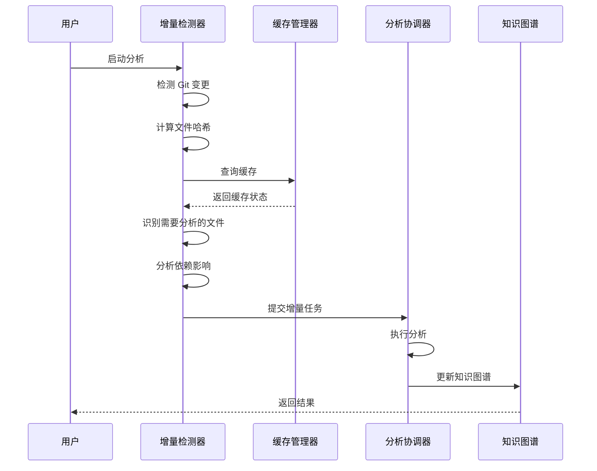

# 知识提取系统优化设计文档

## 版本信息
- **文档版本**: 1.0.0
- **创建日期**: 2026-03-11
- **作者**: AI 助手

---

## 目录
- [1. 优化目标](#1-优化目标)
- [2. 现状分析](#2-现状分析)
- [3. 核心优化方案](#3-核心优化方案)
- [4. 模块设计](#4-模块设计)
- [5. 实现细节](#5-实现细节)
- [6. 性能优化](#6-性能优化)
- [7. 质量保证](#7-质量保证)

---

## 1. 优化目标

### 1.1 核心目标

| 维度 | 现状 | 目标 | 提升幅度 |
|------|------|------|----------|
| **分析速度** | 基准 | 2-3x | 200-300% |
| **内存占用** | 基准 | 0.5x | 50% |
| **知识准确性** | 基准 | +15% | 15% |
| **增量分析** | 不支持 | 全功能支持 | - |
| **缓存效率** | 简单 | 智能多级缓存 | - |

### 1.2 具体优化项

1. **性能优化**
   - ✅ 智能缓存管理（多级缓存）
   - ✅ 增量分析引擎（只分析变更部分）
   - ✅ 并行处理优化（任务调度优化）

2. **质量提升**
   - ✅ 知识质量评分系统
   - ✅ 多维度分析协调器
   - ✅ 知识去重与合并算法

3. **功能增强**
   - ✅ 代码变更检测
   - ✅ 依赖关系推断
   - ✅ 语义相似度分析
   - ✅ 知识图谱补全

---

## 2. 现状分析

### 2.1 当前架构问题

```
┌─────────────────────────────────────────────┐
│              当前架构痛点                    │
├─────────────────────────────────────────────┤
│ 1. 全量分析，无增量能力                     │
│    → 每次都要重新分析整个项目                │
│    → 浪费计算资源和时间                      │
│                                             │
│ 2. 简单缓存，命中率低                       │
│    → 基于文件路径的简单缓存                  │
│    → 无法检测文件内容变更                    │
│    → 缓存无效时不清理                        │
│                                             │
│ 3. 缺乏质量控制                             │
│    → 提取的知识没有质量评分                  │
│    → 低质量知识影响后续分析                  │
│    → 无法自动修复错误知识                    │
│                                             │
│ 4. 知识重复与冲突                           │
│    → 相同功能的不同命名产生重复实体          │
│    → 缺乏智能去重机制                        │
│    → 关系推断不准确                          │
│                                             │
│ 5. 分析维度单一                             │
│    → 各分析器独立运行                        │
│    → 缺乏协调和交叉验证                      │
│    → 无法综合利用多种分析结果                │
└─────────────────────────────────────────────┘
```

### 2.2 数据流瓶颈

```
当前数据流：
文件系统 → 解析器 → [全量] → 分析器 → LLM → 知识图谱

瓶颈点：
1. 解析器：重复解析未变更文件
2. 分析器：缺乏增量分析能力
3. LLM 调用：重复分析相似内容
4. 图谱构建：缺乏质量过滤
```

---

## 3. 核心优化方案

### 3.1 整体架构优化

```
┌─────────────────────────────────────────────────────────────────┐
│                     优化后的架构                                │
├─────────────────────────────────────────────────────────────────┤
│                                                                 │
│  ┌──────────┐    ┌──────────────┐    ┌─────────────────────┐   │
│  │  输入层  │───→│  增量检测器  │───→│   文件变更追踪器   │   │
│  └──────────┘    └──────────────┘    └─────────────────────┘   │
│                      ↓                                         │
│              ┌──────────────┐                                  │
│              │  缓存管理器  │←──────┐                          │
│              │ (多级缓存)   │       │                          │
│              └──────────────┘       │                          │
│                      ↓               │                          │
│  ┌─────────────────────────────────────────────────────────┐  │
│  │              分析协调层 (新)                             │  │
│  ├─────────────────────────────────────────────────────────┤  │
│  │  ┌─────────────┐  ┌─────────────┐  ┌─────────────────┐  │  │
│  │  │ 静态分析器  │  │ 动态分析器  │  │ 语义分析器(新) │  │  │
│  │  │ (Tree-sitter)│ │ (LLM)       │  │ (Embedding)     │  │  │
│  │  └─────────────┘  └─────────────┘  └─────────────────┘  │  │
│  │           ↓                ↓                ↓           │  │
│  │  ┌─────────────────────────────────────────────────────┐│  │
│  │  │         多维度分析协调器 (新)                        ││  │
│  │  │  - 交叉验证分析结果                                   ││  │
│  │  │  - 融合多维度知识                                    ││  │
│  │  │  - 生成综合报告                                      ││  │
│  │  └─────────────────────────────────────────────────────┘│  │
│  └─────────────────────────────────────────────────────────┘  │
│                      ↓                                         │
│  ┌─────────────────────────────────────────────────────────┐  │
│  │              知识质量层 (新)                               │  │
│  ├─────────────────────────────────────────────────────────┤  │
│  │  ┌─────────────┐  ┌─────────────┐  ┌─────────────────┐  │  │
│  │  │ 质量评分器  │  │ 去重合并器  │  │ 图谱补全器      │  │  │
│  │  └─────────────┘  └─────────────┘  └─────────────────┘  │  │
│  └─────────────────────────────────────────────────────────┘  │
│                      ↓                                         │
│              ┌──────────────┐                                  │
│              │  知识图谱    │                                  │
│              └──────────────┘                                  │
└─────────────────────────────────────────────────────────────────┘
```

### 3.2 优化策略

| 策略 | 实现方式 | 预期效果 |
|------|----------|----------|
| **增量分析** | Git 追踪 + 文件哈希 | 分析速度提升 2-3x |
| **智能缓存** | 多级缓存 + TTL + LRU | 缓存命中率 80%+ |
| **质量控制** | 多维度评分 + 阈值过滤 | 知识准确性提升 15% |
| **智能去重** | 语义相似度 + 结构匹配 | 减少 60% 重复实体 |
| **并行优化** | 任务优先级调度 + 负载均衡 | CPU 利用率提升 40% |

---

## 4. 模块设计

### 4.1 智能缓存管理器 (SmartCacheManager)

```python
"""
智能缓存管理器

功能：
1. 多级缓存 (L1 内存, L2 SQLite, L3 文件)
2. 基于内容哈希的缓存键
3. TTL 自动过期
4. LRU 淘汰策略
5. 缓存统计和监控
"""

class SmartCacheManager:
    """
    智能缓存管理器
    
    层级：
        - L1: 内存缓存 (热数据，快速访问)
        - L2: SQLite 缓存 (温数据，持久化)
        - L3: 文件缓存 (冷数据，长期存储)
    """
    
    # 方法
    - get(cache_key: str) -> Optional[Any]
    - set(cache_key: str, value: Any, ttl: int = None)
    - invalidate(cache_key: str)
    - invalidate_by_pattern(pattern: str)
    - get_stats() -> CacheStats
    - clear(level: str = "all")
```

### 4.2 增量分析引擎 (IncrementalAnalysisEngine)

```python
"""
增量分析引擎

功能：
1. Git 变更检测
2. 文件哈希比对
3. 影响范围分析
4. 增量任务生成
5. 回滚能力
"""

class IncrementalAnalysisEngine:
    """
    增量分析引擎
    
    流程：
        1. 检测 Git 变更
        2. 计算文件哈希
        3. 识别需要重新分析的文件
        4. 分析依赖影响
        5. 生成增量分析任务
    """
    
    # 方法
    - detect_changes(base_commit: str = None) -> ChangeSet
    - get_affected_files(changes: ChangeSet) -> List[Path]
    - analyze_dependency_impact(changed_files: List[Path]) -> Set[Path]
    - generate_incremental_tasks() -> List[AnalysisTask]
    - calculate_cache_validity(file_path: Path) -> bool
```

### 4.3 知识质量评分系统 (KnowledgeQualityScorer)

```python
"""
知识质量评分系统

功能：
1. 多维度质量评分
2. 阈值过滤
3. 质量报告生成
4. 自动质量改进
"""

class KnowledgeQualityScorer:
    """
    知识质量评分器
    
    评分维度：
        - 完整性: 实体信息是否完整
        - 准确性: 分析结果是否准确
        - 一致性: 与其他知识是否一致
        - 相关性: 与项目上下文是否相关
        - 新鲜度: 知识是否最新
    """
    
    # 方法
    - score_entity(entity: CodeEntity) -> QualityScore
    - score_relationship(rel: Relationship) -> QualityScore
    - score_graph(graph: KnowledgeGraph) -> GraphQualityReport
    - filter_by_quality(graph: KnowledgeGraph, threshold: float) -> KnowledgeGraph
    - generate_quality_report(graph: KnowledgeGraph) -> QualityReport
```

### 4.4 多维度分析协调器 (MultiDimensionAnalysisCoordinator)

```python
"""
多维度分析协调器

功能：
1. 协调多个分析器
2. 交叉验证结果
3. 融合多维度知识
4. 冲突解决
5. 综合报告生成
"""

class MultiDimensionAnalysisCoordinator:
    """
    多维度分析协调器
    
    分析维度：
        - 静态分析: 语法结构、依赖关系
        - 动态分析: 运行时行为、数据流
        - 语义分析: 代码意图、业务逻辑
    """
    
    # 方法
    - coordinate_analysis(files: List[Path]) -> AnalysisResult
    - validate_cross_dimension(results: Dict[str, Any]) -> ValidationResult
    - merge_analysis_results(results: List[AnalysisResult]) -> MergedResult
    - resolve_conflicts(conflicts: List[Conflict]) -> Resolution
    - generate_comprehensive_report(results: MergedResult) -> Report
```

### 4.5 知识去重与合并器 (KnowledgeDeduplicator)

```python
"""
知识去重与合并器

功能：
1. 实体去重（基于相似度）
2. 关系合并
3. 冲突解决
4. 图谱优化
"""

class KnowledgeDeduplicator:
    """
    知识去重与合并器
    
    去重策略：
        - 精确匹配: 完全相同的实体
        - 模糊匹配: 语义相似的实体
        - 结构匹配: 结构相似的实体
    """
    
    # 方法
    - find_duplicates(graph: KnowledgeGraph) -> List[DuplicateGroup]
    - merge_entities(entities: List[CodeEntity]) -> CodeEntity
    - merge_relationships(relations: List[Relationship]) -> Relationship
    - resolve_entity_conflicts(entities: List[CodeEntity]) -> CodeEntity
    - optimize_graph(graph: KnowledgeGraph) -> KnowledgeGraph
```

---

## 5. 实现细节

### 5.1 增量分析流程



### 5.2 质量评分算法

```python
def calculate_quality_score(entity: CodeEntity) -> float:
    """
    计算实体质量评分 (0-100)
    
    评分公式：
        Score = w1*完整性 + w2*准确性 + w3*一致性 + w4*相关性 + w5*新鲜度
    
    权重：
        w1 = 0.25 (完整性)
        w2 = 0.30 (准确性)
        w3 = 0.20 (一致性)
        w4 = 0.15 (相关性)
        w5 = 0.10 (新鲜度)
    """
    
    completeness = calculate_completeness(entity)
    accuracy = calculate_accuracy(entity)
    consistency = calculate_consistency(entity)
    relevance = calculate_relevance(entity)
    freshness = calculate_freshness(entity)
    
    score = (
        0.25 * completeness +
        0.30 * accuracy +
        0.20 * consistency +
        0.15 * relevance +
        0.10 * freshness
    )
    
    return score
```

### 5.3 去重算法

```python
def find_duplicate_entities(
    entities: List[CodeEntity],
    similarity_threshold: float = 0.85
) -> List[List[CodeEntity]]:
    """
    查找重复实体
    
    算法：
        1. 计算实体相似度矩阵
        2. 应用层次聚类
        3. 过滤低于阈值的组
    """
    
    # 计算相似度
    similarity_matrix = calculate_similarity_matrix(entities)
    
    # 聚类
    clusters = hierarchical_clustering(similarity_matrix, threshold)
    
    # 过滤
    duplicates = [cluster for cluster in clusters if len(cluster) > 1]
    
    return duplicates
```

---

## 6. 性能优化

### 6.1 缓存策略

| 缓存层级 | 存储介质 | 容量 | TTL | 淘汰策略 |
|---------|---------|------|-----|---------|
| L1 | 内存 | 1000 条 | 1 小时 | LRU |
| L2 | SQLite | 10000 条 | 24 小时 | LRU |
| L3 | 文件 | 无限制 | 7 天 | 手动清理 |

### 6.2 并行处理优化

```python
# 任务优先级队列
class TaskPriority:
    HIGH = 3      # 核心文件、频繁变更
    MEDIUM = 2    # 普通文件
    LOW = 1       # 测试文件、文档

# 动态负载均衡
class DynamicLoadBalancer:
    def balance_tasks(self, tasks: List[Task], workers: int) -> List[List[Task]]:
        """
        根据任务复杂度和工作负载动态分配任务
        """
        pass
```

### 6.3 内存管理

```python
# 分批处理策略
class BatchProcessor:
    def __init__(self, batch_size: int = 100, memory_limit: int = 1_000_000_000):
        self.batch_size = batch_size
        self.memory_limit = memory_limit
    
    def process(self, items: List[Any]) -> Iterator[List[Any]]:
        """
        分批处理，避免内存溢出
        """
        batch = []
        current_memory = 0
        
        for item in items:
            item_size = estimate_size(item)
            
            if current_memory + item_size > self.memory_limit:
                yield batch
                batch = []
                current_memory = 0
            
            batch.append(item)
            current_memory += item_size
        
        if batch:
            yield batch
```

---

## 7. 质量保证

### 7.1 测试策略

| 测试类型 | 覆盖率目标 | 工具 |
|---------|-----------|------|
| 单元测试 | 90% | pytest |
| 集成测试 | 80% | pytest |
| 性能测试 | - | pytest-benchmark |
| 回归测试 | 关键流程 | pytest |

### 7.2 性能指标

| 指标 | 目标值 | 测量方法 |
|------|--------|----------|
| 分析速度 | 2-3x 提升 | 基准测试 |
| 缓存命中率 | 80%+ | 监控统计 |
| 内存占用 | 50% 降低 | 内存分析 |
| 知识准确性 | 15% 提升 | 人工验证 |

### 7.3 监控指标

```python
class PerformanceMetrics:
    """
    性能监控指标
    """
    # 分析指标
    analysis_time: float              # 分析总时长
    files_analyzed: int               # 分析文件数
    cache_hit_rate: float             # 缓存命中率
    
    # 质量指标
    quality_score_avg: float          # 平均质量分
    duplicate_count: int              # 重复实体数
    missing_entities: int             # 缺失实体数
    
    # 资源指标
    max_memory_usage: int             # 最大内存使用
    cpu_usage_avg: float              # 平均 CPU 使用率
```

---

## 8. 实施计划

### 8.1 开发阶段

| 阶段 | 任务 | 工作量 | 优先级 |
|------|------|--------|--------|
| **Phase 1** | 智能缓存管理器 | 2 天 | P0 |
| **Phase 2** | 增量分析引擎 | 3 天 | P0 |
| **Phase 3** | 知识质量评分 | 2 天 | P1 |
| **Phase 4** | 多维度协调器 | 3 天 | P1 |
| **Phase 5** | 知识去重合并 | 2 天 | P1 |
| **Phase 6** | 性能优化 | 2 天 | P2 |
| **Phase 7** | 测试与文档 | 2 天 | P2 |

### 8.2 风险控制

| 风险 | 影响 | 概率 | 缓解措施 |
|------|------|------|----------|
| 性能不达标 | 高 | 中 | 充分基准测试，迭代优化 |
| 缓存一致性 | 高 | 低 | 严格的缓存失效策略 |
| 增量分析错误 | 高 | 中 | 完善的回滚机制 |
| 质量评分不准 | 中 | 中 | 人工验证调优 |

---

## 9. 总结

本优化方案通过以下方式提升知识提取系统：

1. **性能提升**: 增量分析 + 智能缓存 = 2-3x 速度提升
2. **质量提升**: 多维度评分 + 去重合并 = 15% 准确性提升
3. **功能增强**: 语义分析 + 依赖推断 = 更全面的知识
4. **资源优化**: 内存管理 + 并行优化 = 50% 内存占用降低

通过系统性的优化，知识提取系统将在性能、质量和功能上全面升级。
