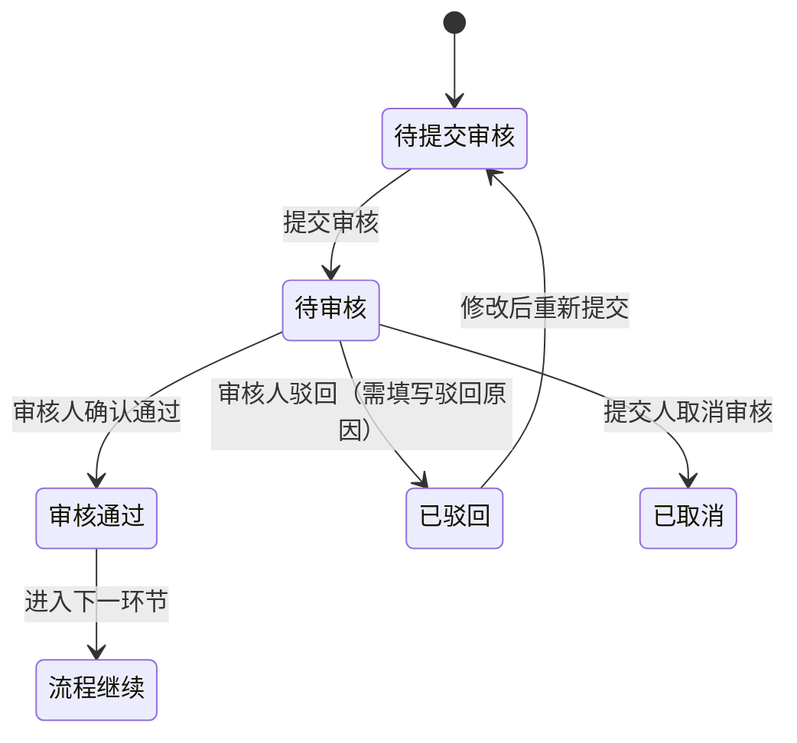

# CodeRefactor AI 平台人工审核体系补充设计文档
> **文档定位**：对原有控制台设计的补充扩展，AI开发工具可1:1落地执行，严格兼容原有技术栈与页面结构
> **核心原则**：风险分级管控、全流程可追溯、强制节点不可跳过、权限与角色绑定
> **不可突破的红线**：P0核心业务模块的4个强制审核节点**必须100%人工审核通过**，流程才可向下推进，禁止任何跳过逻辑
> **技术栈**：完全复用原有技术栈（React 18 + TypeScript 5 + Ant Design 5.20+ + Zustand 4.5+ + React Router v6）

---

## 一、人工审核体系核心规则
### 1.1 强制审核红线（不可修改、不可跳过）
所有P0核心业务模块（核心交易、支付、主链路代码）必须经过以下4个强制审核节点，**任一节点未通过，流程自动终止，不可向下推进**：
1.  业务语义契约审核（扫描建模阶段）
2.  重构方案审批（重构规划阶段）
3.  重构代码人工审核（重构执行阶段）
4.  合并上线最终审批（合并阶段）

### 1.2 审核节点分级规则
| 审核等级 | 适用范围 | 是否可跳过 | 审核权限要求 |
|----------|----------|------------|--------------|
| 强制审核 | P0核心模块全流程、P1高风险模块的重构方案/合并审批、架构级变更、语义验证不通过的代码 | 绝对不可跳过 | 架构师/技术负责人双人审核 |
| 可选审核 | P2通用模块的重构方案/代码、P3边缘模块全流程 | 可通过规则配置开启/关闭 | 资深研发/模块负责人审核 |
| 抽检审核 | P2/P3低风险模块的代码、重构方案 | 系统按配置比例随机抽检 | 资深研发审核 |

### 1.3 审核角色与权限定义
| 角色 | 审核权限 | 操作权限 |
|------|----------|----------|
| 超级管理员 | 全量审核权限、审核规则配置权限 | 全平台操作权限 |
| 架构师 | P0/P1模块的语义契约、重构方案、合并审批权限 | 发起重构、暂停/回滚重构任务 |
| 技术负责人 | P0模块的最终审批权限（双人审核第二人） | 合并代码、终止重构任务 |
| 资深研发 | P1/P2模块的代码审核、语义契约审核权限 | 发起扫描/重构任务、提交审核 |
| 普通研发 | 无审核权限，仅可查看审核状态 | 发起扫描任务、查看代码资产 |
| 测试负责人 | 测试报告、验证结果审核权限 | 驳回验证不通过的重构任务 |

### 1.4 审核状态流转规则

- 审核通过后，**不可逆向撤销**，所有操作留痕存入审计日志
- 驳回必须填写详细驳回原因，支持标注具体代码行、具体问题点
- 重新提交审核时，必须标注修改内容，系统自动对比修改前后差异

---

## 二、路由结构补充（兼容原有路由）
在原有路由基础上，新增审核中心、审核规则配置相关路由，完整路由如下：
```typescript
// 原有路由保持不变，新增以下子路由
const router = createBrowserRouter([
  {
    path: '/',
    element: <ProLayout />,
    children: [
      // 原有路由全部保留，新增以下内容
      {
        path: '/audit',
        label: '审核中心',
        icon: <AuditOutlined />,
        children: [
          {
            index: true,
            element: <AuditTaskList />,
          },
          {
            path: ':auditId',
            element: <AuditTaskDetail />,
          },
        ],
      },
      {
        path: '/settings',
        children: [
          // 原有设置保留，新增审核规则配置子路由
          {
            path: 'audit-rules',
            element: <AuditRulesSettings />,
          },
        ],
      },
    ],
  },
]);
```
**新增页面清单**：
1.  审核中心-待审核任务列表页（`/audit`）
2.  审核任务详情页（`/audit/:auditId`）
3.  系统设置-审核规则配置页（`/settings/audit-rules`）

---

## 三、核心审核页面详细设计
### 页面1：审核中心-待审核任务列表页
**文件路径**：`src/pages/Audit/AuditTaskList/index.tsx`
**页面状态管理**：`src/stores/auditStore.ts`
**API调用**：统一封装在`src/api/audit.ts`
#### 1.1 页面布局
```
┌─────────────────────────────────────────────────────────────────────────────────┐
│ 顶部：全局ProLayout（固定）                                                      │
├─────────────────────────────────────────────────────────────────────────────────┤
│ 内容区（padding:24px）                                                          │
│ ┌─────────────────────────────────────────────────────────────────────────────┐ │
│ │ 第一行：统计卡片（4列，响应式适配）                                          │ │
│ │ ┌──────────────┐ ┌──────────────┐ ┌──────────────┐ ┌──────────────┐ │ │
│ │ 待我审核       │ 我已审核       │ 已驳回        │ 已超时        │ │ │
│ │ （数字+跳转）  │ （数字+跳转）  │ （数字+跳转）  │ （数字+跳转）  │ │ │
│ └──────────────┘ └──────────────┘ └──────────────┘ └──────────────┘ │ │
│ └─────────────────────────────────────────────────────────────────────────────┘ │
│ ┌─────────────────────────────────────────────────────────────────────────────┐ │
│ │ 第二行：筛选与操作栏                                                          │ │
│ │ ┌─────────────────────────────────────────────────────────────────────────┐ │ │
│ │ │ 左侧：搜索框（placeholder="搜索任务名/仓库名/审核编号"）                │ │ │
│ │ │ 中间：筛选器组                                                             │ │ │
│ │ │  - 审核类型筛选：语义契约审核/重构方案审批/代码审核/合并审批              │ │ │
│ │ │  - 风险等级筛选：P0/P1/P2/P3                                              │ │ │
│ │ │  - 审核状态筛选：待审核/已通过/已驳回/已超时                              │ │ │
│ │ │  - 时间范围筛选：创建时间/截止时间                                        │ │ │
│ │ │ 右侧：批量操作按钮（批量通过/批量驳回，仅P2/P3低风险任务可用）            │ │ │
│ └─────────────────────────────────────────────────────────────────────────┘ │ │
│ └─────────────────────────────────────────────────────────────────────────────┘ │
│ ┌─────────────────────────────────────────────────────────────────────────────┐ │
│ │ 第三行：审核任务表格（100%宽度）                                              │ │
│ │ ┌─────────────────────────────────────────────────────────────────────────┐ │ │
│ │ │ 列：                                                                     │ │ │
│ │ │ 1. 审核编号（唯一ID，可点击跳转详情）                                    │ │ │
│ │ │ 2. 审核类型（Tag标签，配色区分）                                        │ │ │
│ │ │ 3. 关联仓库/模块（带风险等级Tag）                                        │ │ │
│ │ │ 4. 关联任务名（扫描/重构任务名，可跳转）                                │ │ │
│ │ │ 5. 提交人/提交时间                                                       │ │ │
│ │ │ 6. 审核截止时间（超时标红）                                              │ │ │
│ │ │ 7. 审核状态（Tag标签，配色区分）                                        │ │ │
│ │ │ 8. 操作：查看详情、通过、驳回（仅待审核状态显示）                        │ │ │
│ └─────────────────────────────────────────────────────────────────────────┘ │ │
│ └─────────────────────────────────────────────────────────────────────────────┘ │
│ ┌─────────────────────────────────────────────────────────────────────────────┐ │
│ │ 第四行：分页器（居中，默认pageSize=20）                                      │ │
│ └─────────────────────────────────────────────────────────────────────────────┘ │
└─────────────────────────────────────────────────────────────────────────────────┘
```
#### 1.2 核心交互规则
1.  **权限过滤**：列表仅展示当前登录用户有权限审核的任务，无权限的任务不显示
2.  **批量操作限制**：P0/P1强制审核任务**禁止批量操作**，必须逐个审核
3.  **超时提醒**：距离审核截止时间不足24小时的任务，标黄高亮；已超时的任务标红，自动推送通知给提交人和审核人
4.  **快捷操作**：待审核任务的操作列，点击「通过」弹出确认框；点击「驳回」弹出驳回意见填写框
5.  **跳转逻辑**：点击审核编号、关联任务名，可直接跳转到对应详情页

---

### 页面2：审核任务详情页
**文件路径**：`src/pages/Audit/AuditTaskDetail/index.tsx`
**页面状态管理**：`src/stores/auditStore.ts`
**API调用**：统一封装在`src/api/audit.ts`
#### 2.1 页面布局（通用结构，按审核类型动态渲染内容）
```
┌─────────────────────────────────────────────────────────────────────────────────┐
│ 顶部：全局ProLayout（固定）                                                      │
├─────────────────────────────────────────────────────────────────────────────────┤
│ 内容区（padding:24px）                                                          │
│ ┌─────────────────────────────────────────────────────────────────────────────┐ │
│ │ 第一行：页面标题与面包屑（返回列表按钮）                                      │ │
│ └─────────────────────────────────────────────────────────────────────────────┘ │
│ ┌─────────────────────────────────────────────────────────────────────────────┐ │
│ │ 第二行：基础信息卡片（24px间距）                                              │ │
│ │ ┌─────────────────────────────────────────────────────────────────────────┐ │ │
│ │ │ 网格布局（2列）：审核编号、审核类型、风险等级、关联仓库、关联任务、        │ │ │
│ │ │ 提交人、提交时间、审核截止时间、当前审核状态、审核人                      │ │ │
│ └─────────────────────────────────────────────────────────────────────────┘ │ │
│ └─────────────────────────────────────────────────────────────────────────────┘ │
│ ┌─────────────────────────────────────────────────────────────────────────────┐ │
│ │ 第三行：核心审核内容区（100%宽度，按审核类型动态渲染）                        │ │
│ │ 【语义契约审核】：展示AI提取的业务语义契约，支持代码原文对比、规则标注        │ │
│ │ 【重构方案审批】：展示原子重构步骤、架构变更、回滚方案、风险评估              │ │
│ │ 【代码审核】：代码差异对比器（左右分栏，重构前/后对比，支持行内标注）        │ │
│ │ 【合并审批】：展示全量修改清单、验证报告、测试覆盖率、重构收益统计            │ │
│ └─────────────────────────────────────────────────────────────────────────────┘ │
│ ┌─────────────────────────────────────────────────────────────────────────────┐ │
│ │ 第四行：审核历史记录卡片（100%宽度）                                          │ │
│ │ 列表展示：操作人、操作时间、操作类型、审核意见、修改前后对比链接              │ │
│ └─────────────────────────────────────────────────────────────────────────────┘ │
│ ┌─────────────────────────────────────────────────────────────────────────────┐ │
│ │ 第五行：审核操作栏（固定在页面底部，背景白色，阴影）                          │ │
│ │ ┌─────────────────────────────────────────────────────────────────────────┐ │ │
│ │ │ 左侧：审核意见输入框（必填，Ant Design Input.TextArea，placeholder="请填写审核意见"） │ │ │
│ │ │ 右侧：操作按钮组                                                           │ │ │
│ │ │  - 取消按钮（默认样式）                                                    │ │ │
│ │ │  - 驳回按钮（红色样式，需填写驳回原因）                                    │ │ │
│ │ │  - 通过按钮（主色样式，P0模块需二次确认）                                  │ │ │
│ └─────────────────────────────────────────────────────────────────────────┘ │ │
│ └─────────────────────────────────────────────────────────────────────────────┘ │
└─────────────────────────────────────────────────────────────────────────────────┘
```
#### 2.2 分类型核心内容区详细设计
##### 2.2.1 语义契约审核内容区
- 左右分栏布局：左侧展示**代码原文**（带行号、语法高亮），右侧展示**AI提取的业务语义契约**（JSON格式化展示，可折叠/展开）
- 支持行内标注：审核人可点击代码行，添加标注意见，自动同步到审核意见框
- 核心校验项高亮：输入输出契约、业务规则、副作用、异常场景用不同颜色高亮
- 对比功能：支持「AI提取契约」与「代码原文」的规则匹配度校验，不匹配的项自动标红

##### 2.2.2 重构方案审批内容区
- 步骤化展示：用Ant Design Steps组件展示原子重构步骤，每个步骤可展开查看详细内容
- 核心信息卡片：
  1.  重构范围与影响面卡片（标注影响的模块、调用方、业务链路）
  2.  风险评估卡片（风险等级、风险点、应对措施）
  3.  回滚方案卡片（回滚步骤、回滚触发条件、回滚验证标准）
- 架构变更对比：支持原有架构图与目标架构图的并排对比
- 合规性校验：自动校验重构方案是否符合架构规范，不符合的项标红提示

##### 2.2.3 代码审核内容区
- 核心组件：复用原有`CodeDiffViewer`组件，左右分栏展示重构前/后代码，支持行内差异高亮、行内标注
- 辅助信息：
  1.  代码修改统计：新增行数、删除行数、修改文件数
  2.  语义一致性验证结果：AI验证报告，有差异的项自动标红
  3.  静态扫描结果：新增技术债务、安全漏洞提示
- 标注功能：审核人可点击差异行，添加审核意见，支持「需修改」「建议优化」「无问题」三种标注类型
- 批量标注：支持全量代码的批量标注、批量导出标注意见

##### 2.2.4 合并审批内容区
- 核心信息卡片组：
  1.  重构全量修改清单（可展开查看每个文件的修改详情）
  2.  验证报告汇总（测试通过率、语义一致性验证结果、静态扫描结果）
  3.  测试覆盖率报告（核心链路覆盖率、分支覆盖率）
  4.  重构收益统计（技术债务减少量、复杂度降低量、代码优化量）
- 前置审核节点展示：展示之前所有审核节点的结果、审核人、审核时间
- 双人审核校验：P0模块的合并审批，必须2位有权限的审核人分别通过，才可完成审批

#### 2.3 核心交互规则
1.  **状态锁定**：已通过/已驳回的审核任务，操作栏自动隐藏，仅可查看不可修改
2.  **必填校验**：驳回操作必须填写驳回原因，通过操作必须填写审核意见（P0模块强制，其他模块可选）
3.  **二次确认**：P0模块的通过操作，必须弹出二次确认框，提示「该操作不可撤销，确认通过？」
4.  **实时保存**：审核人填写的标注、意见，自动实时保存到本地，防止刷新丢失
5.  **流程联动**：审核通过后，自动触发对应任务的流程向下推进；审核驳回后，自动通知任务提交人，任务回退到上一环节

---

### 页面3：系统设置-审核规则配置页
**文件路径**：`src/pages/Settings/AuditRulesSettings/index.tsx`
**页面状态管理**：`src/stores/auditStore.ts`
**API调用**：统一封装在`src/api/audit.ts`
#### 3.1 页面布局
```
┌─────────────────────────────────────────────────────────────────────────────────┐
│ 顶部：全局ProLayout（固定）                                                      │
├─────────────────────────────────────────────────────────────────────────────────┤
│ 内容区（padding:24px）                                                          │
│ ┌─────────────────────────────────────────────────────────────────────────────┐ │
│ │ 第一行：页面标题与保存按钮（右上角，主色按钮）                                │ │
│ └─────────────────────────────────────────────────────────────────────────────┘ │
│ ┌─────────────────────────────────────────────────────────────────────────────┐ │
│ │ 第二行：Tab标签页（Ant Design Tabs）                                          │ │
│ │ ┌─────────────────────────────────────────────────────────────────────────┐ │ │
│ │ │ Tab1：强制审核规则（不可修改，仅可查看）                                  │ │ │
│ │ │ Tab2：可选审核规则配置                                                    │ │ │
│ │ │ Tab3：抽检规则配置                                                        │ │ │
│ │ │ Tab4：审核时效与通知配置                                                  │ │ │
│ │ │ Tab5：审核权限与角色配置                                                  │ │ │
│ └─────────────────────────────────────────────────────────────────────────┘ │ │
│ └─────────────────────────────────────────────────────────────────────────────┘ │
│ ┌─────────────────────────────────────────────────────────────────────────────┐ │
│ │ 第三行：Tab内容区（100%宽度）                                                │ │
│ └─────────────────────────────────────────────────────────────────────────────┘ │
└─────────────────────────────────────────────────────────────────────────────────┘
```
#### 3.2 各Tab内容详细设计
##### Tab1：强制审核规则（只读）
- 列表展示所有不可修改的强制审核规则，每条规则包含：规则名称、适用范围、规则说明、不可修改提示
- 核心规则清单：
  1.  P0核心模块的业务语义契约必须人工审核通过，才可发起重构任务
  2.  P0/P1模块的重构方案必须人工审批通过，才可执行重构代码生成
  3.  P0核心模块的重构代码必须人工审核通过，才可执行合并操作
  4.  P0核心模块的合并上线必须双人审核通过，才可合并到主干分支
  5.  语义一致性验证不通过的代码，必须人工审核确认，才可进入下一环节

##### Tab2：可选审核规则配置
- 表单形式配置，支持开启/关闭以下可选审核规则：
  1.  P1模块的业务语义契约审核（开关，默认开启）
  2.  P2模块的重构方案审核（开关，默认关闭）
  3.  P2模块的代码审核（开关，默认开启）
  4.  P3模块的全流程审核（开关，默认关闭）
  5.  跨模块重构的额外审核（开关，默认开启）
  6.  框架升级/版本迁移的全流程审核（开关，默认开启）
- 每个规则可配置适用范围、审核权限要求

##### Tab3：抽检规则配置
- 表单形式配置，支持以下抽检规则：
  1.  P2模块代码抽检比例（滑块，0%-100%，默认20%）
  2.  P3模块代码抽检比例（滑块，0%-100%，默认5%）
  3.  抽检触发时机（多选：提交审核时、合并前、每日定时）
  4.  抽检规则：随机抽检、高复杂度代码优先、高频修改模块优先
- 配置保存后，系统自动按规则生成抽检任务，推送到对应审核人的待审核列表

##### Tab4：审核时效与通知配置
- 审核时效配置：
  1.  P0模块审核时效（数字输入框，单位：小时，默认24小时）
  2.  P1模块审核时效（数字输入框，单位：小时，默认48小时）
  3.  P2/P3模块审核时效（数字输入框，单位：小时，默认72小时）
  4.  超时处理规则（单选：自动驳回、推送提醒、升级通知给上级）
- 通知配置：
  1.  审核任务提交通知（开关，默认开启，渠道：站内信/邮件/企业微信）
  2.  审核状态变更通知（开关，默认开启，渠道：站内信/邮件/企业微信）
  3.  审核超时提醒（开关，默认开启，提前12小时/6小时/1小时分三次提醒）
  4.  驳回通知（开关，默认开启，渠道：站内信/邮件/企业微信）

##### Tab5：审核权限与角色配置
- 表格形式展示角色与审核权限的映射关系，支持编辑（仅超级管理员可修改）
- 列：角色名称、语义契约审核权限、重构方案审批权限、代码审核权限、合并审批权限、可审核的风险等级、操作
- 支持新增自定义角色、编辑现有角色的权限、禁用角色

---

## 四、原有页面的审核交互补充
### 4.1 代码仓库详情页补充
- 新增「业务语义契约审核」Tab页，展示该仓库下所有模块的语义契约审核状态
- 新增批量提交审核按钮，可选择多个模块的语义契约，批量提交审核
- 每个模块的风险等级标签旁，新增审核状态标签（待审核/已通过/已驳回）
- 核心交互：只有P0模块的语义契约审核通过后，「发起重构」按钮才可点击，否则置灰并提示「请先完成核心模块的语义契约审核」

### 4.2 扫描任务详情页补充
- 新增「审核状态」模块，展示扫描结果中需要审核的内容清单
- 新增「提交语义契约审核」按钮，扫描完成后，可一键提交所有待审核的语义契约到审核中心
- 扫描报告中，新增审核状态列，标注每个模块的契约审核状态
- 核心交互：扫描完成后，自动校验P0模块的语义契约，生成待审核任务，推送给审核人

### 4.3 重构任务详情页补充
- 新增「审核流程」步骤条，展示整个重构流程的审核节点完成状态
- 原子任务列表中，新增审核状态列，每个原子任务的审核状态清晰展示
- 新增「提交重构方案审批」按钮，重构规划完成后，可一键提交方案到审核中心
- 核心交互：
  1.  重构方案未通过审批前，「执行重构」按钮置灰不可点击
  2.  代码生成完成后，自动提交代码审核任务到审核中心
  3.  代码审核未通过前，「合并代码」按钮置灰不可点击
  4.  每个审核节点驳回后，任务自动回退到对应环节，支持修改后重新提交审核

### 4.4 原子任务详情页补充
- 新增审核操作栏，展示该原子任务的审核状态、审核历史、审核意见
- 代码差异区新增审核标注功能，支持审核人逐行添加意见
- 新增「提交审核」「重新提交审核」按钮，可单独提交单个原子任务的审核

---

## 五、核心审核组件详细设计（可复用）
### 组件1：审核状态标签（AuditStatusTag）
**文件路径**：`src/components/Audit/AuditStatusTag/index.tsx`
**Props定义**：
```typescript
import { TagProps } from 'antd';

interface AuditStatusTagProps {
  status: 'pending' | 'approved' | 'rejected' | 'timeout' | 'cancelled';
  text?: string;
  size?: TagProps['size'];
}
```
**实现要求**：
- 严格对应状态配色：pending→#1677ff（蓝色）、approved→#52c41a（绿色）、rejected→#ff4d4f（红色）、timeout→#faad14（橙色）、cancelled→#86909c（灰色）
- 默认文本：待审核、已通过、已驳回、已超时、已取消
- 支持自定义文本、自定义大小，完全兼容Ant Design Tag组件API

### 组件2：审核操作栏（AuditActionBar）
**文件路径**：`src/components/Audit/AuditActionBar/index.tsx`
**Props定义**：
```typescript
interface AuditActionBarProps {
  auditId: string;
  status: 'pending' | 'approved' | 'rejected' | 'timeout' | 'cancelled';
  riskLevel: 'P0' | 'P1' | 'P2' | 'P3';
  onApprove: (auditId: string, opinion: string) => Promise<void>;
  onReject: (auditId: string, reason: string) => Promise<void>;
  onCancel: () => void;
  disabled?: boolean;
}
```
**实现要求**：
- 固定在页面底部，带顶部阴影，z-index高于其他内容
- 包含审核意见输入框（必填校验）、取消按钮、驳回按钮、通过按钮
- P0模块的通过按钮，点击后弹出二次确认Modal
- 状态非pending时，整个操作栏置灰不可操作
- 加载状态绑定API请求，按钮带loading效果

### 组件3：审核历史记录（AuditHistoryList）
**文件路径**：`src/components/Audit/AuditHistoryList/index.tsx`
**Props定义**：
```typescript
interface AuditHistoryItem {
  id: string;
  auditId: string;
  operator: {
    id: string;
    name: string;
    role: string;
  };
  action: 'submit' | 'approve' | 'reject' | 'cancel' | 're_submit';
  opinion?: string;
  operateTime: string;
  diffLink?: string;
}

interface AuditHistoryListProps {
  data: AuditHistoryItem[];
  loading?: boolean;
}
```
**实现要求**：
- 用Ant Design Timeline组件实现，按操作时间倒序排列
- 每个操作节点带操作人、角色、操作时间、操作意见
- 有diffLink的节点，新增「查看修改对比」按钮，点击弹出CodeDiffViewer模态框
- 支持按操作类型筛选、按时间范围筛选

### 组件4：审核类型标签（AuditTypeTag）
**文件路径**：`src/components/Audit/AuditTypeTag/index.tsx`
**Props定义**：
```typescript
import { TagProps } from 'antd';

interface AuditTypeTagProps {
  type: 'semantic_contract' | 'refactoring_plan' | 'code_review' | 'merge_approval';
  text?: string;
  size?: TagProps['size'];
}
```
**实现要求**：
- 严格对应类型配色：semantic_contract→#722ed1（紫色）、refactoring_plan→#13c2c2（青色）、code_review→#fa8c16（橙色）、merge_approval→#eb2f96（粉色）
- 默认文本：语义契约审核、重构方案审批、代码审核、合并审批
- 完全兼容Ant Design Tag组件API

---

## 六、状态管理补充（Zustand Store）
```typescript
// src/stores/auditStore.ts
import { create } from 'zustand';
import { devtools } from 'zustand/middleware';
import {
  getAuditTaskList,
  getAuditTaskDetail,
  approveAuditTask,
  rejectAuditTask,
  getAuditRules,
  updateAuditRules,
  batchSubmitAudit,
} from '../api/audit';

// 类型定义
interface AuditTaskItem {
  auditId: string;
  auditType: 'semantic_contract' | 'refactoring_plan' | 'code_review' | 'merge_approval';
  riskLevel: 'P0' | 'P1' | 'P2' | 'P3';
  repositoryName: string;
  moduleName?: string;
  relatedTaskId: string;
  relatedTaskName: string;
  submitter: { id: string; name: string };
  submitTime: string;
  deadline: string;
  status: 'pending' | 'approved' | 'rejected' | 'timeout' | 'cancelled';
  auditor?: { id: string; name: string };
}

interface AuditTaskDetail extends AuditTaskItem {
  content: any; // 审核核心内容，按类型动态变化
  history: Array<{
    id: string;
    operator: { id: string; name: string; role: string };
    action: string;
    opinion?: string;
    operateTime: string;
    diffLink?: string;
  }>;
}

interface AuditRules {
  mandatoryRules: Array<{ id: string; name: string; description: string }>;
  optionalRules: Record<string, { enabled: boolean; scope: string[]; permission: string[] }>;
  samplingRules: {
    p2SamplingRate: number;
    p3SamplingRate: number;
    triggerTiming: string[];
    samplingStrategy: string;
  };
  timeoutRules: {
    p0Timeout: number;
    p1Timeout: number;
    p2p3Timeout: number;
    timeoutHandler: string;
  };
  notificationRules: Record<string, { enabled: boolean; channels: string[] }>;
  permissionRules: Array<{ role: string; permissions: string[]; riskLevels: string[] }>;
}

interface AuditState {
  // 列表数据
  taskList: AuditTaskItem[];
  total: number;
  page: number;
  pageSize: number;
  filters: Record<string, any>;
  // 详情数据
  currentTask: AuditTaskDetail | null;
  // 规则数据
  auditRules: AuditRules | null;
  // 统计数据
  stats: {
    pending: number;
    approved: number;
    rejected: number;
    timeout: number;
  };
  // 加载状态
  loading: {
    list: boolean;
    detail: boolean;
    rules: boolean;
    action: boolean;
  };
  // 错误状态
  error: string | null;
  // 操作方法
  fetchTaskList: (params: { page?: number; pageSize?: number; filters?: Record<string, any> }) => Promise<void>;
  fetchTaskDetail: (auditId: string) => Promise<void>;
  approveTask: (auditId: string, opinion: string) => Promise<void>;
  rejectTask: (auditId: string, reason: string) => Promise<void>;
  fetchAuditRules: () => Promise<void>;
  updateAuditRules: (rules: Partial<AuditRules>) => Promise<void>;
  batchSubmitAudit: (data: { type: string; relatedIds: string[] }) => Promise<void>;
  clearCurrentTask: () => void;
}

// Store实现
export const useAuditStore = create<AuditState>()(
  devtools(
    (set, get) => ({
      // 初始状态
      taskList: [],
      total: 0,
      page: 1,
      pageSize: 20,
      filters: {},
      currentTask: null,
      auditRules: null,
      stats: {
        pending: 0,
        approved: 0,
        rejected: 0,
        timeout: 0,
      },
      loading: {
        list: false,
        detail: false,
        rules: false,
        action: false,
      },
      error: null,
      // 操作方法
      fetchTaskList: async (params) => {
        set({ loading: { ...get().loading, list: true }, error: null });
        try {
          const { data, total, stats } = await getAuditTaskList(params);
          set({
            taskList: data,
            total,
            stats,
            page: params.page || 1,
            pageSize: params.pageSize || 20,
            filters: params.filters || {},
          });
        } catch (err: any) {
          set({ error: err.message });
        } finally {
          set({ loading: { ...get().loading, list: false } });
        }
      },
      fetchTaskDetail: async (auditId) => {
        set({ loading: { ...get().loading, detail: true }, error: null });
        try {
          const data = await getAuditTaskDetail(auditId);
          set({ currentTask: data });
        } catch (err: any) {
          set({ error: err.message });
        } finally {
          set({ loading: { ...get().loading, detail: false } });
        }
      },
      approveTask: async (auditId, opinion) => {
        set({ loading: { ...get().loading, action: true }, error: null });
        try {
          await approveAuditTask(auditId, opinion);
          // 更新本地状态
          const { taskList, currentTask } = get();
          const newTaskList = taskList.map(item => 
            item.auditId === auditId ? { ...item, status: 'approved' } : item
          );
          set({
            taskList: newTaskList,
            currentTask: currentTask?.auditId === auditId ? { ...currentTask, status: 'approved' } : currentTask,
          });
        } catch (err: any) {
          set({ error: err.message });
          throw err;
        } finally {
          set({ loading: { ...get().loading, action: false } });
        }
      },
      rejectTask: async (auditId, reason) => {
        set({ loading: { ...get().loading, action: true }, error: null });
        try {
          await rejectAuditTask(auditId, reason);
          // 更新本地状态
          const { taskList, currentTask } = get();
          const newTaskList = taskList.map(item => 
            item.auditId === auditId ? { ...item, status: 'rejected' } : item
          );
          set({
            taskList: newTaskList,
            currentTask: currentTask?.auditId === auditId ? { ...currentTask, status: 'rejected' } : currentTask,
          });
        } catch (err: any) {
          set({ error: err.message });
          throw err;
        } finally {
          set({ loading: { ...get().loading, action: false } });
        }
      },
      fetchAuditRules: async () => {
        set({ loading: { ...get().loading, rules: true }, error: null });
        try {
          const data = await getAuditRules();
          set({ auditRules: data });
        } catch (err: any) {
          set({ error: err.message });
        } finally {
          set({ loading: { ...get().loading, rules: false } });
        }
      },
      updateAuditRules: async (rules) => {
        set({ loading: { ...get().loading, action: true }, error: null });
        try {
          const newRules = await updateAuditRules(rules);
          set({ auditRules: newRules });
        } catch (err: any) {
          set({ error: err.message });
          throw err;
        } finally {
          set({ loading: { ...get().loading, action: false } });
        }
      },
      batchSubmitAudit: async (data) => {
        set({ loading: { ...get().loading, action: true }, error: null });
        try {
          await batchSubmitAudit(data);
        } catch (err: any) {
          set({ error: err.message });
          throw err;
        } finally {
          set({ loading: { ...get().loading, action: false } });
        }
      },
      clearCurrentTask: () => {
        set({ currentTask: null });
      },
    }),
    { name: 'audit-store' }
  )
);
```

---

## 七、API接口补充
```typescript
// src/api/audit.ts
import api from './index';

// 获取审核任务列表
export const getAuditTaskList = async (params: {
  page?: number;
  pageSize?: number;
  filters?: Record<string, any>;
}) => {
  return await api.get('/audit/tasks', { params });
};

// 获取审核任务详情
export const getAuditTaskDetail = async (auditId: string) => {
  return await api.get(`/audit/tasks/${auditId}`);
};

// 通过审核任务
export const approveAuditTask = async (auditId: string, opinion: string) => {
  return await api.post(`/audit/tasks/${auditId}/approve`, { opinion });
};

// 驳回审核任务
export const rejectAuditTask = async (auditId: string, reason: string) => {
  return await api.post(`/audit/tasks/${auditId}/reject`, { reason });
};

// 取消审核任务
export const cancelAuditTask = async (auditId: string) => {
  return await api.post(`/audit/tasks/${auditId}/cancel`);
};

// 批量提交审核
export const batchSubmitAudit = async (data: {
  type: string;
  relatedIds: string[];
}) => {
  return await api.post('/audit/tasks/batch-submit', data);
};

// 获取审核规则
export const getAuditRules = async () => {
  return await api.get('/audit/rules');
};

// 更新审核规则
export const updateAuditRules = async (rules: Record<string, any>) => {
  return await api.put('/audit/rules', rules);
};

// 获取审核统计数据
export const getAuditStats = async () => {
  return await api.get('/audit/stats');
};
```

---

## 八、消息通知机制
1.  **站内信通知**：审核任务提交、状态变更、超时提醒、驳回时，自动给对应用户发送站内信，右上角导航栏新增消息图标，带未读数量红点
2.  **邮件通知**：可配置开启，审核任务相关通知同步发送到用户邮箱
3.  **超时升级通知**：审核任务超时未处理，自动升级通知给审核人的上级负责人
4.  **实时推送**：用WebSocket实现审核任务状态的实时推送，无需刷新页面即可更新列表状态

---

## 九、最终验收标准
1.  **功能完整性**：实现本文档定义的所有审核页面、组件、规则、交互，无遗漏
2.  **红线合规性**：P0模块的4个强制审核节点不可跳过，未通过审核时，对应流程按钮必须置灰不可点击
3.  **权限控制**：严格按角色权限展示审核任务，无权限的任务不可查看、不可操作
4.  **全链路留痕**：所有审核操作必须记录到审计日志，包含操作人、操作时间、操作类型、审核意见、IP地址，不可删除、不可修改
5.  **交互体验**：所有审核操作有加载状态、错误提示、成功反馈，表单有完整的校验规则
6.  **代码质量**：全量代码符合TypeScript严格模式，核心组件测试覆盖率≥80%，完全兼容原有页面结构与技术栈
7.  **流程联动**：审核状态变更后，必须自动联动对应扫描/重构任务的流程状态，无延迟、无异常